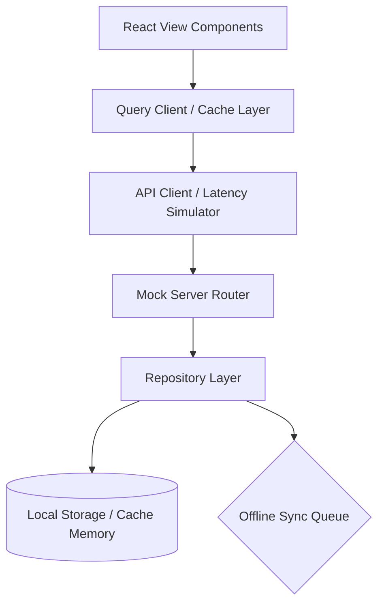
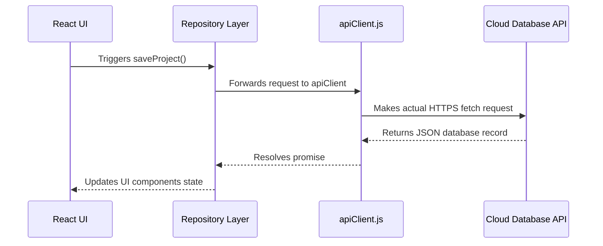

# AI Engineer OS - Complete Project Documentation

Welcome to the comprehensive, enterprise-grade architecture documentation for **AI Engineer OS**. This guide details the folder layouts, design tokens, query caching clients, offline sync strategies, and backend adaptation roadmaps.

---

## 1. Directory & Folder Layout Structure

The codebase is organized into modular directories to isolate concerns and support future scalability:

```bash
AI-Engineer-OS/
├── public/                  # Static assets and icons
├── src/
│   ├── components/          # Reusable React components
│   │   ├── Common/          # Atomic components (Card, Button, Accordion, etc.)
│   │   ├── Dashboard/       # Dashboard-specific widgets and cards
│   │   └── Layout/          # Structural UI wrappers (Sidebar, Viewport)
│   ├── context/             # Domain-specific state contexts
│   │   ├── AuthContext.jsx
│   │   ├── ProjectsContext.jsx
│   │   └── WorkspaceManagerContext.jsx
│   ├── data/                # Seed datasets and mock databases
│   ├── hooks/               # Custom state logic hooks (Keyboard, Metadata)
│   ├── pages/               # Page view controller routes
│   │   ├── LearningPage.jsx
│   │   ├── ProjectsPage.jsx
│   │   └── PluginsPage.jsx
│   ├── repositories/        # Data Layer Abstraction (Repository Pattern)
│   ├── services/            # Business logic and mock servers
│   │   ├── ai/              # AI Provider strategies and orchestrators
│   │   ├── apiClient.js     # Simulated HTTP Client
│   │   ├── queryClient.js   # SWR-style Caching Client
│   │   └── mockServer.js    # Local API Request Router
│   ├── styles/              # Design system styling files
│   │   ├── base/            # Design tokens and resets (variables, transitions)
│   │   └── components/      # Component-specific layout styles
│   ├── utils/               # General utility files (Logger)
│   ├── App.jsx              # Routing rules and wrappers
│   └── main.jsx             # Application entry point
├── package.json
├── vite.config.js
└── README.md
```

---

## 2. System Architecture

AI Engineer OS uses a decoupled, event-driven architecture structured around a client-side database layer:



### Core Architecture Components:
1. **Query & Caching Client (`queryClient.js`)**: An SWR-like data fetcher caching requests using query keys. It keeps data in memory with a default 5-minute TTL to reduce redundant read operations.
2. **API Client (`apiClient.js`)**: A simulated fetch client that injects standard headers, auth tokens, and simulates a 150-400ms network latency to mimic production API requests.
3. **Mock Server Router (`mockServer.js`)**: Intercepts apiClient calls and routes endpoints (like `/api/projects`) directly to the namespaced Repository Layer.
4. **Repository Layer (`src/repositories/`)**: Abstracted classes (e.g. `ProjectRepository`, `PlannerRepository`) that manage storage interactions. They are dependency-injection-ready, making them ready to swap localStorage for real databases.

---

## 3. Notion-Style Workspaces & State Partitioning

Users can create and isolate separate workspaces (e.g. college notes, placement preparation, machine learning projects).

### Partitioning Rules:
- The `WorkspaceManagerContext` exposes the `activeWorkspaceId`.
- Every repository automatically appends this `activeWorkspaceId` to storage key names (e.g. `college_projects` vs `personal_projects`), keeping data workspaces fully isolated.
- Switching workspaces in the Sidebar switcher automatically invalidates the cache keys in the `queryClient`, causing page data to re-fetch and update reactively.

---

## 4. State Management Strategy

To maintain high performance as data scales, the global state is divided into domain-specific React Contexts:
- **`WorkspaceManagerContext`**: Manages active workspaces, colors, icons, and switcher status.
- **`ProjectsContext`**: Manages sprint boards, milestones, tasks checklist, and IDE file runners.
- **`LearningContext`**: Manages adaptive curricula, revision loops, heatmaps, and diagnostic scores.
- **`AuthContext`**: Manages session profiles, permissions vectors, and login gates.

> [!TIP]
> All contexts use memoized value exports (`React.useMemo`) to prevent unnecessary component re-renders when unrelated parent states change.

---

## 5. Offline-First Sync Queue & Conflicts Resolution

The system uses an offline-first storage strategy. When a network connection is lost or simulated offline mode is active:
- Repositories write changes locally and push a sync action to a **Sync Queue** inside `offlineSyncService`.
- A floating **Offline Sync Status Widget** displays pending sync counts and connection states.
- If a sync conflict occurs (e.g. local data and server data mismatch), the **Conflict Resolution UI** presents the differences side-by-side. The user can select to **Keep Local Version** or **Keep Cloud Version** to resolve the conflict.

---

## 6. Coding Standards & Naming Conventions

To keep code clean and maintainable for open-source development, developers must follow these guidelines:

### File Naming:
- **React Components / Pages**: Use PascalCase (e.g., `ProjectDetails.jsx`, `PluginsPage.jsx`).
- **Styles / CSS**: Use lowercase with hyphens (e.g., `auth.css`, `dashboard-card.css`).
- **Services / Repositories**: Use camelCase (e.g., `apiClient.js`, `ProjectRepository.js`).

### React Best Practices:
- Write functional components with hooks.
- Abstract complicated business logic out of UI files and place them inside repository models or services.
- Never write hardcoded variables or pixel metrics inline; always use values defined in the Design System.

---

## 7. Enterprise Design System & Styling Tokens

All layouts follow standard variables declared in [variables.css](file:///d:/coding/AI-Engineer-OS/src/styles/base/variables.css):

### System Scales:
- **Spacing**: Space 1 (4px) to Space 12 (48px) units.
- **Typography**: Text sizes range from `--font-size-xs` (12px) to `--font-size-2xl` (28px). Font weights range from `--font-weight-regular` (400) to `--font-weight-black` (850).
- **Elevation System**: Shadows scale from `--elev-low` to `--elev-high` alongside cyan and pink glassmorphism glowing indicators.
- **Radius System**: Radii range from `--radius-xs` (4px) to `--radius-full` (9999px).

---

## 8. Deployment & Build Guide

The application uses Vite for fast client builds.

### Setup & Launch Commands:
```bash
# Install dependencies
npm install

# Start local dev server
npm run dev

# Compile production bundle
npm run build
```

The production output is generated in the `/dist` directory. This output consists of optimized static assets that can be hosted on platforms like Vercel, Netlify, Cloudflare Pages, or AWS S3.

---

## 9. Future Backend & Database Integration Roadmap

To transition this architecture-ready mockup into a cloud SaaS application, follow this plan:



### Steps to Integrate a Real Database:
1. **Initialize a Cloud DB**: Set up a PostgreSQL database (e.g., Supabase or Neon) or a MongoDB database.
2. **Update the API Client**: Replace the interceptor logic inside [apiClient.js](file:///d:/coding/AI-Engineer-OS/src/services/apiClient.js) with real fetch calls to your backend domain:
   ```javascript
   // Replace interceptor handleRequest with a real fetch call:
   const res = await fetch(`${BACKEND_URL}${endpoint}`, { method, headers, body });
   ```
3. **Migrate Local Repositories**: Update repository files to pull data from your API instead of relying on mock data:
   ```javascript
   // ProjectRepository.js example update:
   getProjects: async (workspaceId) => {
     return apiClient.get(`/api/projects?workspace=${workspaceId}`);
   }
   ```
4. **Configure Real Authentication**: Swap the simulated session values in `AuthContext` for JWT tokens from services like Firebase Auth, Auth0, or Supabase Auth.
